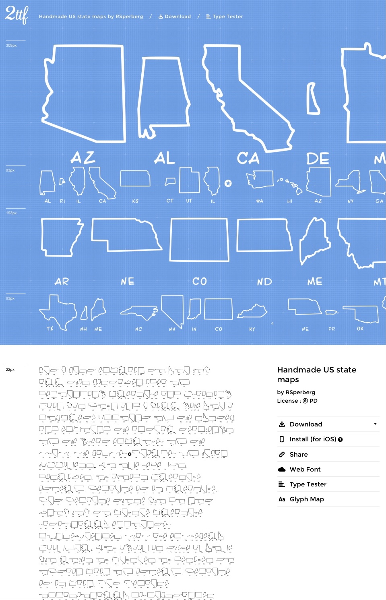
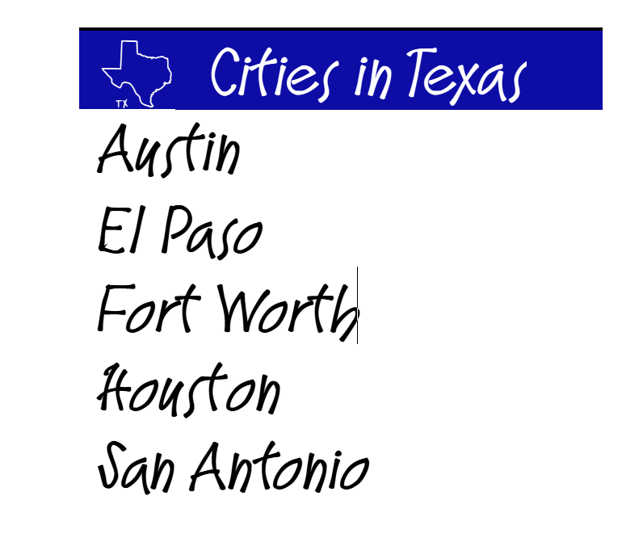

# US-state-maps
Hand-drawn fonts of the 50 U.S. states (and Puerto Rico)

The source .archive files are in the file format used by iFontMaker, the iPad font-design tool made by Eiji and Tom, Inc., which you can find at 2ttf.com.

The fonts are released under the OFL, the SIL Open Font License.

